<h3><code>bhav@github ~ $ ./contributions.sh</code></h3>

  

<h3><code>bhav@github ~ $ whoami</code></h3>

<table>
  <tr>
    <td valign="top"></td>
    <td valign="top"></td>
  </tr>
</table>

 

### `bhav@github ~ $ cat about.txt`

Eval-first agentic AI engineer. I build the harness around the agent, not just the agent.
Retrieval and agent quality are regression-tested with measured confidence intervals, not asserted.

 

### `bhav@github ~ $ ./projects.sh`

**DocRAG** &nbsp;·&nbsp; eval-first agentic RAG
Hybrid BM25 + ChromaDB retrieval with cross-encoder reranking, scored on the live LangGraph pipeline. Reranking lifted context precision `0.49 -> 0.78 [0.63, 0.90]`, with the recall/faithfulness tradeoff measured (recall `0.85`), not hidden.

**DocRAG red-team harness**
Indirect prompt injection across 5 payload families, poison-in-context verified per case. Command-style and keyword-guardrail families held `0% ASR / 0% FPR`. Isolated authority-framed content poisoning as the class requiring a semantic detector.

**GitHub PR Review Agent** &nbsp;·&nbsp; [repo](https://github.com/BhavneetBhoria29/github-pr-review-agent)
Four parallel LangGraph agents on AWS EKS (FastAPI, Celery/Redis, PostgreSQL) with Langfuse/Prometheus/Grafana observability and token-cost tracking at `sub-200ms p95`. Terraform-provisioned. Every LLM and tool call traceable.

**Multi-agent LangGraph pipeline**
Chatbot, tool-augmented chatbot, and news aggregator with LangSmith tracing and a RAGAS evaluation loop. Faithfulness `1.00`, answer relevancy `0.932`, regression-tested against a golden set.

Portfolio projects above ship with production-style observability. My deployment serving real external users was an early production RAG pipeline at Resolute Worldwise: ~40% triage reduction, sub-200ms p95 on AWS.

 

### `bhav@github ~ $ ls stack/`

`Python` `LangGraph` `LangChain` `LlamaIndex` `RAGAS` `FastAPI` `ChromaDB` `LiteLLM` `MCP` `Claude Code` `Docker` `Kubernetes` `AWS (EKS/Lambda/S3)` `Terraform` `Langfuse` `Prometheus` `Grafana` `PostgreSQL` `Celery` `Redis`

 

<h3><code>bhav@github ~ $ cat links.txt</code></h3>

[Portfolio](https://bhavs-portals.lovable.app) &nbsp;&middot;&nbsp;
[LinkedIn](https://linkedin.com/in/bhavneet-bhoria) &nbsp;&middot;&nbsp;
[Email](mailto:bhavrajput97@gmail.com)

<!--
  Art generated by the scripts in ./scripts (no third-party stat services, no token).
  Heatmap refreshes daily via .github/workflows/update-profile-art.yml
  Portrait + card are static, regenerate only when your photo or details change:
    python scripts/prep_photo.py source-photo.jpg   # -> source-prepped.png
    python scripts/make_ascii_svg.py                # -> avi-ascii.svg
    python scripts/make_info_card.py                # -> info-card.svg
-->
